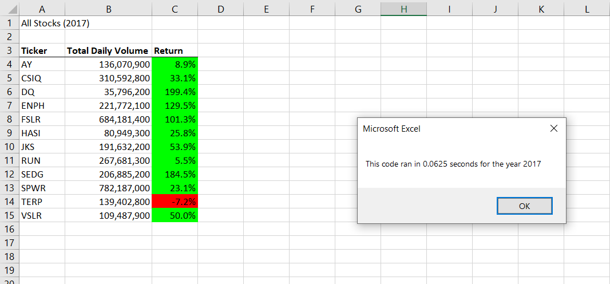
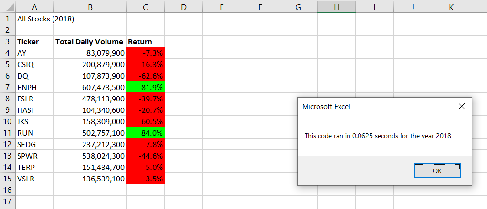

# StocksAnalysis

## Overview of Project
The purpose of this project is to analyze stock data for green stocks. The code achieves this by looking at total volume over the course of a year and the yearly return rate for 12 specified stocks.

## Results
### Stock Analysis (performance 2017 vs 2018)
The images below show the stock summaries for 2017 and 2018. In 2017 all the green stocks, other than TERP, had positive returns; these varied, but the highest were DQ and SEDG. In 2018 only two of the green stocks had positive returns; they were ENPH and RUN. Since RUN had 5.5% return in 2017, but ENPH was 129.5% in 2017 and 81.9% in 2018, it seems to have the most consistent performance of the stocks listed. 

 

### Refactoring Analysis
Refactoring the code reduced the number of loops and included formatting. It resulted in improving the time to run the program. The images above show the run time from the refactored code. Originally, the code took 0.33 and 0.34 seconds and after refactoring 0.0625 seconds. This is a 81% improvement. In both cases the code ran in less than one second. The Excel sheet with code can be found here: [VBA_Challenge.xlsm](VBA_Challenge.xlsm)

## Summary
### Advantages/Disadvantages of refactoring code
Refactoring code can help increase the speed, or decrease the processor usage of a code. This can make it run faster or more efficiently. Additionally, refactoring code can make the code easier to read and easier to edit or change in the future. In this case, refactoring the code made it simpler and did improve the speed. If the code is to be used in the future for additional stock analysis for different ticker values, the code would need additional changes. For example, instead of manually calling out all the ticker names in the tickers array, additional changes can be made to determine these values within the code. If refactoring included that as well, it would make the code more efficient for future applications. This code is included in the [VBA_Challenge.xlsm](VBA_Challenge.xlsm) as "AllStocksAnalysisRefactored2".

Depending on the specific code you may spend significant amount of time refactoring the code. In this case, the increased speed achieved was less than one second, but refactoring took approximately 30 minutes. The time spent would not break even until the code has been run over 6,900 times. In this case, the code was only run a few times saving less than 1 second. In other cases, time could be spent on refactoring without actually achieving improvements.

